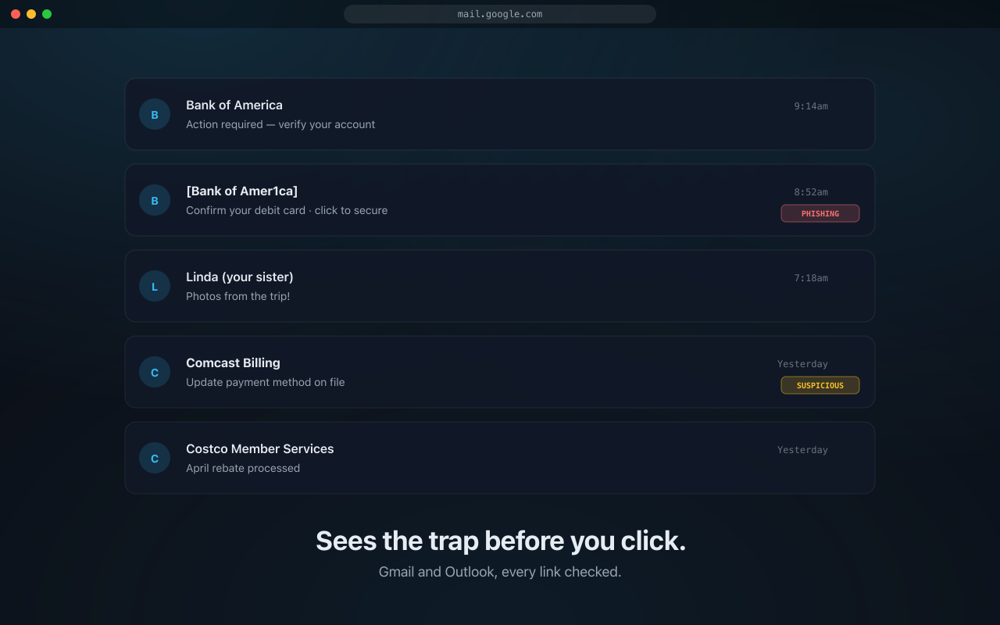

# Gone Phishin'

A free Chrome extension that warns older internet users before they click
phishing or malware links inside Gmail and Outlook — built for the people
in your life who are most often targeted, with a caregiver dashboard so an
adult child can set it up for a parent without becoming tech support.

**Live:** https://gonephishin.tech · **Privacy:** /privacy · **Support:** /support



---

## What it does

- Marks dangerous links inside Gmail and Outlook with an inline pill so
  the user can see at a glance which messages are sketchy.
- Intercepts the click on a phishing or malware page and shows a calm,
  plain-English warning modal — one button to safety, no scary red wall.
- Pairs a caregiver's dashboard to a family member's browser via a
  6-digit code read over the phone — no email links to click (which
  would be ironic), no shared passwords, no managed Google account.
- Catches a class of phishing that pure URL-based checks miss: links
  whose anchor text mentions a known brand ("download Adobe…") but
  whose destination domain belongs to nobody related.

## Live URLs

| | |
|---|---|
| Marketing + dashboard | https://gonephishin.tech |
| Privacy policy | https://gonephishin.tech/privacy |
| Support | https://gonephishin.tech/support |
| Chrome Web Store | https://chromewebstore.google.com/detail/gone-phishin/ifckleibjeadbcebapahhahhleoifofb |
| Latest extension build | https://github.com/Yumstezy/gonephishin/releases/latest |

---

## How it works

```
                       ┌────────────────────────────────┐
                       │  Gmail / Outlook (web)         │
                       │  ┌──────────────────────────┐  │
  Reads anchor href ◄──┤  │  Content script (MV3)    │  │
  + anchor text only   │  │  + click-time intercept  │  │
                       │  │  + warning modal (Shadow │  │
                       │  │    DOM, isolated)        │  │
                       │  └──────────┬───────────────┘  │
                       └─────────────┼──────────────────┘
                                     │ scan-urls msg
                                     ▼
                       ┌────────────────────────────────┐
                       │  Service worker (background)   │
                       │  • 24h verdict cache           │
                       │  • Bearer token for paired     │
                       │    browsers                    │
                       └─────────────┬──────────────────┘
                                     │ POST /api/scan
                                     ▼
                       ┌────────────────────────────────┐
                       │  Next.js 15 API on Vercel      │
                       │  • Local heuristics first      │
                       │    (typosquat, IDN homoglyph,  │
                       │    suspicious TLD, brand-      │
                       │    impersonation)              │
                       │  • Safe Browsing v4 lookup     │
                       │    for unknown URLs            │
                       │  • Per-IP rate limit (Postgres)│
                       └─────────────┬──────────────────┘
                                     │ writes danger event
                                     ▼
                       ┌────────────────────────────────┐
                       │  Neon Postgres (Drizzle ORM)   │
                       └─────────────┬──────────────────┘
                                     │ read
                                     ▼
                       ┌────────────────────────────────┐
                       │  Caregiver dashboard           │
                       │  (signed-in Next.js page)      │
                       └────────────────────────────────┘
```

Privacy-by-design: the extension never reads email contents, subjects,
senders, recipients, or attachments — only anchor URLs already visible
on the rendered page. The dashboard's threat log keeps the **domain**
of flagged links, never the full URL.

---

## What was interesting to build

A few of the technical decisions worth pointing out:

### Anchor-text-aware brand-mismatch heuristic

The first version of the scanner only inspected URL features (typosquats,
IDN homoglyphs, suspicious TLDs, IP-only links, excessive subdomains).
Then a real-world failure: a Microsoft Attack Simulator email with
"Click here to download the Adobe update" pointing at `payrolltooling.com`.
That URL is on no Safe Browsing list (by design — it's a known-safe
simulator) and no URL-only heuristic could catch it.

Fix: the scanner now ships a small structured payload — `{ url, anchorText }` —
and the server runs a brand-mismatch check that fires when the anchor text
contains both a CTA verb (`click here`, `download`, `verify`, `log in`,
`claim`…) **and** a recognized brand name (Adobe, Microsoft, PayPal,
Bank of America, IRS…) while the destination host belongs to none of
that brand's allowlisted domains. False-positive guard: a casual mention
("read more about Apple on TechCrunch") doesn't trip the rule because
the CTA filter requires both signals. Promoted to `verdict=dangerous`
since the signal is high-confidence — the URL-only heuristics stay
`sketchy`.
[`apps/web/lib/heuristics.ts`](apps/web/lib/heuristics.ts) ·
[tests](apps/web/lib/heuristics.test.ts)

### Click-time intercept on the capture phase

The warning modal needs to fire **before** the page's own click handlers
run. The guard listens to `pointerdown` (not `click`) on the capture
phase, so it stops middle-click, ⌘/Ctrl-click, and right-click → "open
in new tab" before any propagation.
[`apps/extension/src/content/shared/click-guard.ts`](apps/extension/src/content/shared/click-guard.ts)

### Shadow-DOM-isolated warning modal

The modal is appended to a Shadow DOM root attached to a host element on
the page, so Gmail and Outlook's aggressive page-level CSS can't bleed
in and the extension's styles can't bleed out. The host element is
sized 0×0 and positioned off-flow until activation.
[`apps/extension/src/content/shared/warning-modal.ts`](apps/extension/src/content/shared/warning-modal.ts)

### Caregiver pairing without email links

Setting up a non-technical relative usually requires either (a) a shared
password (terrible) or (b) "click this email link" (extra terrible for
a phishing-protection product). Gone Phishin' uses a 6-digit code with
a 5-minute TTL: the caregiver generates the code on their dashboard
and reads it over the phone; the relative types it into the extension
popup. The popup exchanges the code for a long-lived bearer token via
`/api/pair/redeem`, and the dashboard receives events scoped to that
token's circle. No email links, no shared accounts.
[`apps/web/app/api/pair/`](apps/web/app/api/pair)

### Build-time anchor-text plumbing across three workspaces

Anchor text flows from the content script → message-passed to the
service worker → forwarded to the API. Adding it after the fact
required threading an optional `meta: Array<{ anchorText?: string }>`
through three TypeScript packages without breaking the existing
`urls`-only request shape, plus a cache-skip rule (since cache keys
were URL-only and identical URLs can have different anchor text).

---

## Stack

- **Monorepo:** Turborepo + pnpm workspaces (`apps/web`, `apps/extension`,
  `packages/shared`)
- **Web app:** Next.js 15 (App Router) · TypeScript · React 19 · Tailwind 3 · Vercel
- **Auth:** Clerk
- **Database:** Drizzle ORM · Neon serverless Postgres (via Vercel Marketplace)
- **Threat intel:** Google Safe Browsing v4 Lookup API · 5 local heuristics
  including the brand-mismatch one above
- **Extension:** Manifest V3 · Vite · CRXJS · React popup
- **Testing:** Vitest (heuristics, URL skip rules, rate limit, Safe Browsing client)
- **Tooling:** TypeScript strict mode, ESLint, Prettier-style formatting via
  the Geist Sans + Geist Mono font system on the marketing site

---

## Repo layout

```
apps/
├── web/                Next.js marketing + dashboard + API routes
│   ├── app/
│   │   ├── (app)/      Authenticated dashboard (Clerk-gated layout)
│   │   ├── api/        /scan, /events/log, /pair/*
│   │   ├── privacy/
│   │   ├── support/
│   │   └── page.tsx    Marketing landing page (dark Glowing-Sky theme)
│   ├── components/marketing/   Hero, value-props, showcase, FAQ, etc.
│   ├── components/dashboard/   Pairing-code display, etc.
│   ├── lib/heuristics.ts       The phishing detection logic + tests
│   └── lib/db/                 Drizzle schema + client + migrations
├── extension/          MV3 Chrome extension
│   ├── manifest.config.ts
│   └── src/
│       ├── background/         Service worker, API client, cache, diagnostics
│       ├── content/            Per-site adapters (gmail, outlook), click-guard,
│       │                       warning modal (Shadow DOM), link painter, scanner
│       ├── popup/              React popup (status, pair, settings)
│       └── shared/             Settings + paired state + message types
└── packages/
    └── shared/         API + verdict types shared between web and extension

docs/
├── ROADMAP.md          Five-stage product plan with explicit anti-goals
├── PROMO.md            Two-week launch playbook
└── store/              Chrome Web Store assets (zip, screenshots, listing copy)
```

---

## Local dev

```bash
# Install once
pnpm install

# Web app (Next.js dev server, http://localhost:3000)
pnpm --filter @gonephishin/web dev

# Extension (Vite + CRXJS, hot-reloads when you Load Unpacked the dist/ folder)
pnpm --filter @gonephishin/extension dev
```

Required env vars (see `apps/web/.env.example`):
- `DATABASE_URL` — Neon Postgres connection string
- `SAFE_BROWSING_API_KEY` — from Google Cloud Console
- Clerk publishable + secret keys (auto-injected on Vercel via the marketplace
  integration)

To load the extension locally:
1. Build with `pnpm --filter @gonephishin/extension build`
2. Open `chrome://extensions`, toggle Developer mode
3. Load unpacked → point at `apps/extension/dist`

---

## Status

- **Web app:** live at https://gonephishin.tech
- **Chrome Web Store:** [published](https://chromewebstore.google.com/detail/gone-phishin/ifckleibjeadbcebapahhahhleoifofb)
  as of v0.1.2 (after two earlier rejections that taught me listing
  copy must match the manifest exactly, and that the "Privacy Policy
  URL" field really does mean the privacy page, not the homepage)
- **Custom domain:** `gonephishin.tech` registered + attached to Vercel
- **First real users:** in progress — see [`docs/PROMO.md`](docs/PROMO.md)
  for the launch plan

---

## License

Source-available for portfolio review. No formal open-source license at the
moment — drop me a note if you'd like to use any of this code in your own
project.
