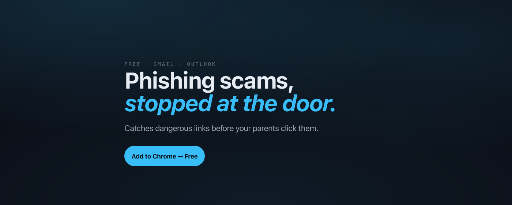
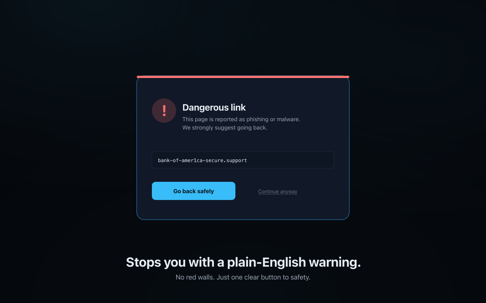
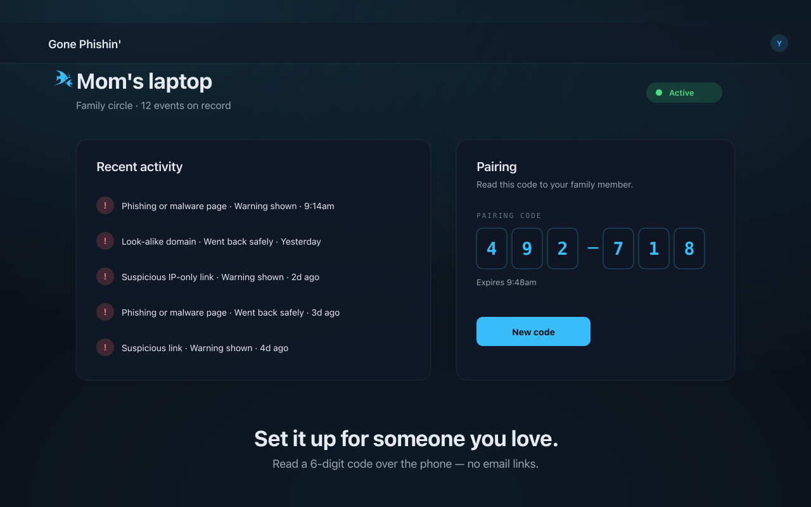

# Gone Phishin' — Launch & Promo Playbook

_Written 2026-05-02. The goal of this doc is to take you from "Web Store
listing in review" to "first 50 real installs, including 5 older adults"
in roughly two weeks of focused effort, without spending a dollar on ads
or doing anything that's likely to get you flagged as spam._



> ⚠️ **Don't start most of this until the Web Store approves the listing.**
> Sharing a Web Store URL that 404s is the surest way to lose the trust
> of the first wave of clicks. Most of this plan is "what to do when the
> approval email lands" — the only pre-approval items are the warm-network
> outreach in **Day 0**.

---

## Who you're trying to reach

There are two distinct audiences. The promo plan splits between them.

### Audience A — caregivers (most of your installs come from here)

- **Who they are:** adults aged 30–55 with a parent or grandparent who
  uses email but isn't tech-savvy. They've already had the conversation
  with mom/dad about a sketchy link they almost clicked. They're
  worried, slightly resigned, and would happily install something if it
  was free, easy, and they didn't have to maintain it.
- **Where they hang out online:** Reddit (`r/AskOldPeople`, `r/sysadmin`,
  `r/cybersecurity`, `r/Dad`, `r/Mom`, regional subreddits), Hacker
  News, LinkedIn (especially IT/security roles), Facebook neighborhood
  groups, group texts.
- **What gets them to act:** A short, honest pitch. **"Free Chrome
  extension that warns my mom before she clicks a phishing link in
  Gmail."** That's the whole pitch. You don't need to convince them —
  they already worry about this.

### Audience B — the older adults themselves

- **Who they are:** 60+, primary-Gmail-or-Outlook users, get phishing
  emails weekly, have heard horror stories from neighbors.
- **Where they hang out online:** Mostly *not* online. AARP forums,
  local senior centers, church bulletins, Nextdoor, neighborhood
  Facebook groups. Hardest to reach digitally.
- **What gets them to act:** Recommendation from someone they trust —
  usually their kid or grandkid (Audience A). **You don't pitch them
  directly. You give Audience A the vocabulary, screenshots, and link
  to send to them.**

---

## What you're selling them

Three screenshots tell the whole story. Save them for every channel.

### 1. The inbox view — sees the trap before they click


This is the headline image. It explains the entire product in three
seconds without anyone reading any text.

### 2. The warning modal — stops them with a plain-English explanation



This is the "okay I get it" moment. Most phishing protection looks
scary and technical — this one looks like something your mom would
actually read instead of dismissing.

### 3. The caregiver dashboard — what the adult child sees



This is the surprise hit. People don't realize a "set-it-up-for-mom"
flow exists until they see it. **This is the screenshot that closes
the deal with Audience A** — they instantly understand that they can
help without becoming tech support.

---

## Day-by-day schedule

The whole plan is two weeks. Don't try to do everything on day one — it
won't compound and you'll burn out.

### Day 0 (today, before approval)

Things you can do *while waiting* that don't need the Web Store URL.

- [ ] Set up Cloudflare Email Routing (you already started this — make
      sure `support@gonephishin.tech` and friends actually deliver to
      your inbox).
- [ ] Double-check the live site reads cleanly on mobile and desktop.
      Open https://gonephishin.tech in an incognito window. Click
      every link. Test sign-up. Test sign-in.
- [ ] Pick **one** real older adult in your life — your parent, a
      grandparent, an aunt — and decide that *they* are user #1. Plan
      to install it on their machine the day after approval.
- [ ] Write down the names of **5 friends with older parents** in a
      note. These are your warm-DM list for Day 2.

### Day 1 — the day Web Store approval lands

- [ ] Add `NEXT_PUBLIC_EXTENSION_ID` to Vercel and redeploy. (Command
      is in `docs/store/SUBMIT.md`.)
- [ ] Update the marketing site's "Install free" CTA to point at the
      Web Store URL instead of `/sign-up`. Same for nav and hero. One
      commit.
- [ ] Update the Web Store listing's privacy + support URLs to the
      `gonephishin.tech` versions if they're still on the temporary
      `vercel.app` ones.
- [ ] Install the extension on your own primary browser. Use it for a
      day. Make sure nothing breaks under daily use. Find the bug you
      didn't know existed.
- [ ] **Tell no one publicly yet.** You want at least 24 hours of
      "soak time" with you alone using it.

### Day 2 — install on user #1, then warm DMs

- [ ] Install Gone Phishin' on the older adult you picked yesterday.
      Set up a caregiver circle for them. Sit with them for 10 minutes
      while they go through their inbox so you can watch what fires
      and what doesn't.
- [ ] DM your 5 friends with older parents, one at a time. Use this
      template — verbatim is fine:

  > Hey, I built a free Chrome extension that catches phishing links
  > in Gmail/Outlook for my [parent / grandparent]. It's specifically
  > designed for non-technical people — just a calm warning that says
  > "this looks dangerous, go back" instead of a scary red wall.
  > Would you set it up for your [mom/dad]? I want to know what their
  > inbox catches over a week.
  >
  > [Web Store URL]
  >
  > (No accounts needed for them. Caregiver mode means their threats
  > show up on your dashboard, with no email reading on either end.)

  Goal: **3 of those 5 say yes.**

### Day 3 — Reddit, low and slow

Reddit can ban a brand-new account that posts links. Use *your*
account, post in places where you already participate, and lead with
useful content — not promotion.

- [ ] **r/InternetIsBeautiful** — title: *"Built a free Chrome extension
      that warns my mom before she clicks phishing links in Gmail"*.
      Top of post: a short story (3–5 sentences) about why you built
      it. Then the screenshot. Then "If anyone wants to try it, [Web
      Store URL]." Then the privacy promise: "doesn't read email,
      doesn't track browsing, doesn't sell anything."
- [ ] **r/cybersecurity** — title: *"Free MV3 extension that combines
      Safe Browsing with anchor-text-based brand-impersonation
      heuristics for Gmail/Outlook"*. More technical framing.
      Mention the brand-mismatch heuristic, mention that Microsoft
      Attack Simulator domains specifically don't trip Safe Browsing.
      That's the angle people in this sub care about.
- [ ] **r/sysadmin** — title: *"Made this for my parents — sharing in
      case it helps yours"*. Sysadmins universally have to set up
      tech for relatives. They'll empathize.

**One subreddit a day, max two.** Do not crosspost the same text — each
post should be tailored to that sub's tone. If a post does well, the
next day's plan is to read every comment and reply, not to post somewhere
else.

### Day 4 — Hacker News (Show HN)

The biggest single source of "right kind of person" traffic for an
extension like this, *if* you frame it right.

- [ ] Post on Hacker News between **8–10 AM Pacific on a weekday**
      (Tuesday or Wednesday optimal). Title:

      Show HN: Gone Phishin' – Chrome extension that warns older
      relatives before they click phishing links

  First comment (post it from your own account immediately): a
  one-paragraph "I built this because…" story. HN responds to honest,
  specific motivation more than to feature lists.

- [ ] **Be in the comments for the next 6 hours.** Reply to every
      comment, especially the critical ones. Don't get defensive — the
      product gets better when you take the criticism seriously. The
      ones that hurt are usually the ones with the highest information
      content.
- [ ] If the post falls off the front page within an hour, that's fine.
      Don't repost. Move on.

### Day 5 — LinkedIn (yourself + IT folks in your network)

- [ ] Post on your own LinkedIn. Tone: personal, slightly vulnerable.
      Template:

  > Spent the last few months building this for my [parent /
  > grandparent]. Free Chrome extension that warns them before they
  > click a phishing link in Gmail or Outlook.
  >
  > Why this and not the dozens that already exist: it's designed for
  > the person clicking, not the security analyst reading the report.
  > The warning is a calm sentence with a single button to safety —
  > not a red wall they'll dismiss.
  >
  > If you have a parent / aunt / grandparent who should have this,
  > the link is in the comments. If you work in IT and want to suggest
  > improvements, reach out — I'm specifically looking for false-
  > positive reports right now.

  Link in the first comment, not the post itself (LinkedIn's algorithm
  punishes posts with external links).

- [ ] DM 3 IT/security people in your LinkedIn network individually.
      Same warm-DM template as Day 2 but framed for an IT audience:
      "you probably set up tech for your parents — would you try this
      one?"

### Day 6 — Local / community channels

- [ ] **Nextdoor** post in your neighborhood (and your parents'
      neighborhood, if you can post there). Title: *"Free phishing
      protection for my neighbors' parents and grandparents."*
      Older demographic on Nextdoor — the audience you actually want
      to reach is here.
- [ ] **One Facebook group** you're already in (parenting group,
      neighborhood group, your alumni group). Lead with the story of
      *why* you built it, not the product.
- [ ] If you have time: write a short piece on your own blog or
      LinkedIn newsletter. *"What I learned building a phishing
      extension for non-technical users."* Honest, useful, not a
      sales pitch.

### Day 7 — read everything, decide what's working

- [ ] Open the dashboard. How many real users do you have? Look at
      the danger-events table. Anyone other than you firing warnings?
- [ ] Read every Reddit/HN comment thread. Note three patterns:
      - what people *liked*
      - what people *misunderstood*
      - what they *wished it did*
- [ ] Pick **one** thing from "what they wished it did" and decide
      whether to ship it next week. Just one. Discipline matters more
      than feature velocity at this stage.
- [ ] If you got <10 real installs from all of this, that's normal.
      Don't redo the same channels next week — try Product Hunt, a
      different subreddit, or a longer-form post somewhere instead.

---

## Templates you can copy-paste

### Reddit / Hacker News title formats

| Place | Title that works |
|---|---|
| r/InternetIsBeautiful | _"Free Chrome extension that warns my [parent] before they click phishing links in Gmail"_ |
| r/cybersecurity | _"Free MV3 extension: Safe Browsing + anchor-text-based brand-impersonation heuristics, for Gmail/Outlook"_ |
| r/sysadmin | _"Made this for my parents — sharing in case it helps yours"_ |
| Hacker News | _"Show HN: Gone Phishin' – warns older relatives before they click phishing in Gmail/Outlook"_ |
| Product Hunt | _"Gone Phishin' – Phishing protection your grandma will actually use"_ |

### Warm-DM template (for friends with older parents)

```
Hey — I built a free Chrome extension that catches phishing links in
Gmail/Outlook for my [parent / grandparent]. It's specifically
designed for non-technical people — calm warning that says "this looks
dangerous, go back" instead of a scary red wall.

Would you set it up for your [mom/dad]? I want to know what their
inbox catches over a week.

https://gonephishin.tech (Web Store link inside)
```

### One-paragraph "what is this" pitch

> Gone Phishin' is a free Chrome extension that watches the links in
> Gmail and Outlook and warns you before you click anything dangerous.
> It uses Google's Safe Browsing list plus a few of its own heuristics
> for newer attacks — including a brand-impersonation check that
> catches "click here to download Adobe" → fake-domain phishing that
> Safe Browsing alone misses. You can use it solo, or pair it to a
> dashboard so an adult child can see what's been blocked for a
> parent's browser. It never reads email content. Free, no ads, no
> tracking.

---

## What NOT to do

These usually feel productive but waste time at this stage.

- **Don't run paid ads.** You don't know who converts yet. Ad spend
  pre-PMF is a way to set money on fire.
- **Don't crosspost the same text** to 8 subreddits. Reddit will
  shadow-ban you and the posts won't be visible.
- **Don't make a fake review or upvote farm.** Communities sniff
  this out and the reputational damage outlasts the boost.
- **Don't email cold press / journalists** yet. Wait until you have
  a story (e.g. "1,000 installs, here's what we caught"). A press
  email with no traction goes in the trash.
- **Don't pivot the messaging weekly.** Pick one tagline ("phishing,
  stopped at the door" / "phishing protection your grandma will
  actually use") and stick with it for a month. Branding compounds.
- **Don't add features in week 1.** Every install you get is feedback.
  Listen, don't ship.

---

## Sidebar — should we train an ML model on phishing links?

Short answer: **no, not now, and probably not for the next 6 months.**

Long answer:

- The data is the easy part — PhishTank and OpenPhish publish open
  feeds of confirmed phishing URLs. You can train a small classifier
  on character n-grams + lexical features in an afternoon.
- The hard parts are everything else:
  - **False positives are catastrophic for this UX.** If 1% of legit
    links get flagged, older users see a warning every few minutes
    and stop trusting the extension. ML models don't have a great
    track record at sub-0.1% false-positive rates without a
    human-in-the-loop pipeline.
  - **Inference cost & latency.** Every URL the user looks at would
    pay an ML round-trip. Heuristics + a Safe Browsing lookup is
    free and ~30ms. ML adds cost without obvious benefit until the
    miss rate of the current system gets noticeably bad.
  - **Maintenance.** Models drift. You'd need a retraining pipeline,
    monitoring, a holdout set, etc. That's all real work for a solo
    project to maintain forever.
  - **The frontier is moving.** Big providers (Google, Microsoft,
    Cloudflare) all have entire teams on this. Catching up to their
    feeds with a homegrown model is a years-long project.

What to do instead:

- Keep adding **rules** when real users report misses. Each rule is
  small, testable, and bounded — exactly the shape of work that
  scales for a solo dev.
- The brand-impersonation heuristic we shipped today is a great
  template — narrowly scoped, high precision, only fires when the
  signal is unambiguous.
- If at the 1-year mark you have lots of real misses and a steady
  user base, *then* a small URL classifier might be worth it as a
  layer underneath the rules. But it's a stage-5+ decision, not a
  week-1 one.

---

## Success checks for this week

- [ ] Web Store listing approved and live
- [ ] At least 1 older-adult install (a parent, grandparent, or aunt)
- [ ] At least 5 total installs (you + your test users + warm-DMs)
- [ ] At least one warning fires for a non-you user, on an email you
      didn't plant
- [ ] At least 10 honest comments / DMs about the product (good or
      bad — both are signal)

If you hit those, the rest of the ROADMAP.md plan starts unlocking. If
not, before doing more, talk to the people who installed it but didn't
keep using it. That conversation is worth more than another launch
post.
